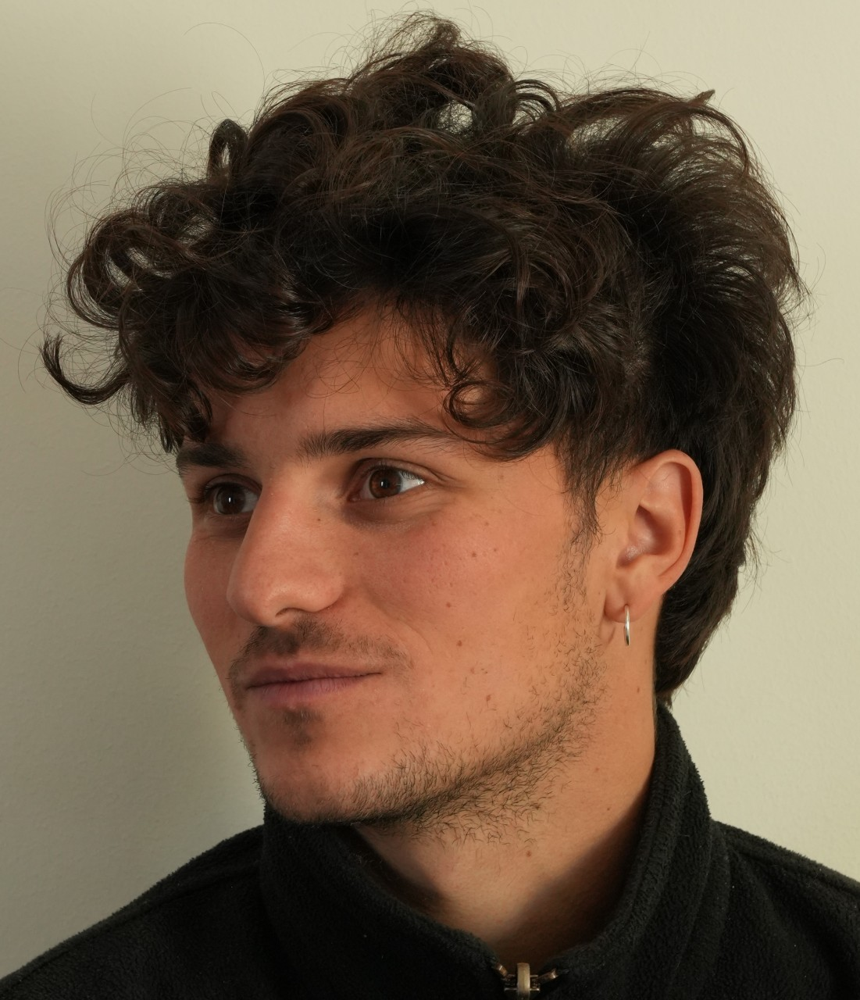

::: {.about-layout}

::: {.about-side}
{.about-photo}

Biologie, écologie & évolution

[Email](mailto:sachalafargue@gmail.com)

:::

::: {.about-main}

Je m'appelle Sacha Lafargue et je suis étudiant en Master Biodiversité, Écologie, Évolution à l'Université de Rennes, parcours Modélisation en écologie.

Je me suis réorienté vers la biologie après une première année d'architecture, puis j'ai passé une année d'échange à l'Universidad de Los Andes, à Bogotá. En 2022–2023, j'ai fait un stage de recherche à l'IRD de Montpellier sur les cancers transmissibles chez les hydres, ce qui a confirmé mon intérêt pour l'écologie évolutive et le travail en laboratoire.

En dehors de mes études, je pratique l'ornithologie et l'entomologie en amateur, je grimpe régulièrement depuis quatre ans, et j'ai fait plusieurs voyages à vélo, notamment un trajet France–Maroc.

Je suis à la recherche d'un stage en écologie évolutive ou comportementale, sur le terrain ou en laboratoire. N'hésitez pas à me contacter.

:::

:::
